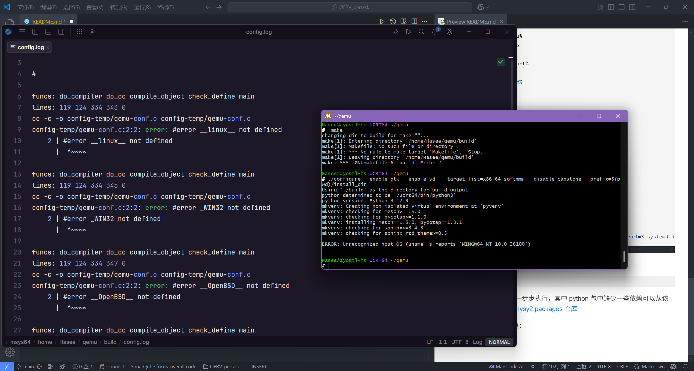
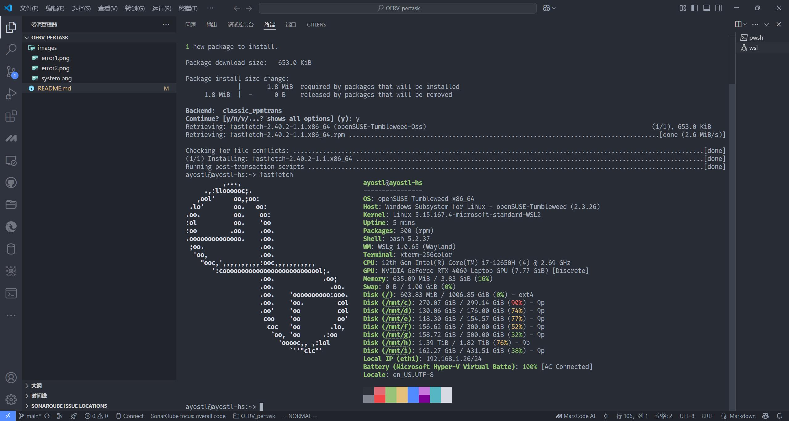
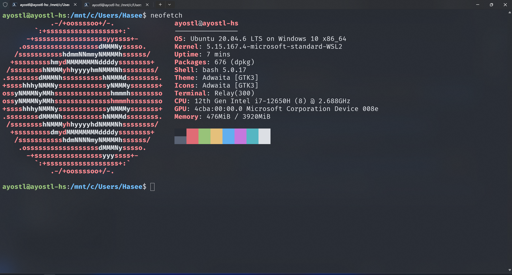

# OERV_pertask工作前准备

---

## 有关详细内容请阅读相关材料

> OERV 实习生帮助文档 [github 连接](https://github.com/openeuler-riscv/oerv-team/blob/main/Intern/guide.md "OERV 实习生指南")

## pretask（省流版）

> pretask 的目的是帮助实习生一起搭建工作环境，熟悉 oerv 的工作流程和合作方式。 pretask 分为三个步骤：
>
> 任务一：通过 QEMU 仿真 RISC-V 环境并启动 openEuler RISC-V 系统，设法输出 fastfetch 结果并截图提交
>
> 任务二：在 openEuler RISC-V 系统上通过 obs 命令行工具 osc，从源代码构建 RISC-V 版本的 rpm 包，比如 pcre2。（提示首先需要在 openEuler的 OBS什么是 OBS？ 上注册账号 <https://build.tarsier-infra.isrc.ac.cn）>
>
> 任务三：尝试使用 qemu user & nspawn 或者 docker 加速完成任务二
>
> 任务完成的方式为在本仓库提交 PR，并在 PR 的 Conversation 中附上任务完成截图，在 Intern/intern_message.md 的 实习生信息 下中加入自己的信息（pretask 考核的一部分）。这个阶段希望实习生养成积极提问和正确提问的习惯，并且构建属于自己的工作流和环境。

## 任务一

> 通过 QEMU 仿真 RISC-V 环境并启动 openEuler RISC-V 系统，设法输出 fastfetch 结果并截图提交

本机环境介绍：

[](https://github.com/ayostl/OERV_pertask/tree/main/images/system.png)

由于本地声卡无Linux驱动暂时只能使用 Windows 系统，所以我们需要使用 [QEMU for Windows](https://qemu.weilnetz.de/w64/2019/ "点击跳转到 QEMU 下载页") 进行 QEMU 模拟器的安装

> 参考资料：[初始 openEuler（一）](https://www.openeuler.org/zh/blog/traffic_millions/2020-03-27-qemu.html "初试 openEuler（一）：windows 下使用 qemu 安装 openEuler ")

安装过程：

1. 下载 [QEMU for Windows](https://qemu.weilnetz.de/w64/qemu-w64-setup-20250326.exe "点击下载 QEMU for Windows 20250326") 并解压到本地目录中，通过 exe 可执行文件进行安装
2. 下载 [openEuler 25.03](https://www.openeuler.org/zh/download/#openEuler%2025.03 "点击跳转到 openEuler 25.03 下载页") 选择 RISC-V 架构的云计算中的 qcow2.xz 虚拟机镜像文件
3. 编辑系统环境变量 PATH ，确保 QEMU 能够在终端内执行
4. 创建一个文件夹 **openEuler_RISCV** 用于保存虚拟机文件，并将 **qcow2.xz** 解压到该文件夹中
5. 进入 QEMU 安装目录，并在其 share 子文件夹中找到 **edk2-riscv-code.fd** 文件并一同复制到该目录中
6. 打开终端（ PowerShell ），输入以下命令启动虚拟机：

```PowerShell
qemu-system-riscv64 `
  -m 4096 `
  -cpu rv64 `
  -smp 4 `
  -M virt `
  -bios edk2-riscv-code.fd `
  -hda openEuler-24.03-LTS-SP1-riscv64.qcow2 `
  -serial vc:800x600
```

启动后出现以下界面：
[](https://github.com/ayostl/OERV_pertask/tree/main/images/error1.png)

又找了一份文档，尝试以下脚本：

```sh
@echo off
chcp 65001
set vcpu=4
set memory=4
set drive=openEuler-22.09-riscv64-qemu-xfce.qcow2
set fw=fw_payload_oe_qemuvirt.elf
set ssh_port=12055

echo :: Starting VM...
echo :: Using following configuration

echo vCPU Cores: %vcpu%
echo Memory: %memory%G
echo Disk: %drive%
echo SSH Port: %ssh_port%

set path="F:\qemu";%PATH%
qemu-system-riscv64 `
  -nographic `
  -machine virt `
  -smp %vcpu% `
  -m %memory%G `
  -kernel "%fw%" `
  -bios none `
  -drive file=%drive%,format=qcow2,id=hd0 `
  -device virtio-vga `
  -device virtio-blk-device,drive=hd0 `
  -device virtio-net-device,netdev=usernet `
  -netdev user,id=usernet,hostfwd=tcp::"%ssh_port%"-:22 `
  -device qemu-xhci `
  -usb `
  -device usb-kbd `
  -device usb-tablet `
  -append "root=/dev/vda1 rw console=ttyS0 swiotlb=1 loglevel=3 systemd.default_timeout_start_sec=600 selinux=0 highres=off mem=512M earlycon"
```

尝试从源码构建：

> [QEMU Wiki](https://wiki.qemu.org/Hosts/W32 "点击跳转到 QEMU Wiki")

通过 Wiki 上的帮助文档一步步执行，其中 python 包中缺少一些依赖可以从该链接下载，以完成构建 [mysy2.packages 仓库](https://packages.msys2.org/ "点击跳转到 mysy2.packages 仓库")

但是我遇到了以下下错误：

[](https://github.com/ayostl/OERV_pertask/tree/main/images/error2.png)

暂时拼劲全力无法解决（日后再去解决吧），转而使用 Wsl 方案，虚拟机看起来太抽象了，还是 Wsl 好一点

仓皇建立了一个 wsl 虚拟机，试图用 wsl 来安装 qemu 模拟 riscv 环境

[](https://github.com/ayostl/OERV_pertask/tree/main/images/openSUSE.png "openSUSE WSL2")

重新从源码构建 qemu ,但是无法编译成功，悲），以后有时间再研究吧

重新安装了一个[](https://github.com/ayostl/OERV_pertask/tree/main/images/Ubuntu.png "Ubuntu WSL2")

重新构建依赖并尝试从源码构建 qemu

> [QEMU Wiki](https://wiki.qemu.org/Hosts/Linux "点击跳转到 QEMU Wiki")